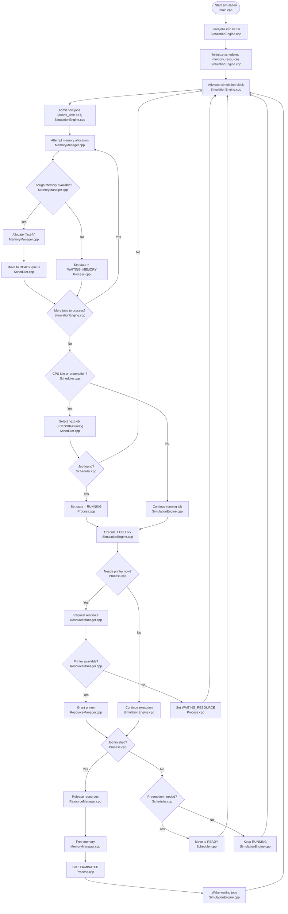

# OS Simulation Project (C++)

This project is a user-space operating system simulator for an OS class. It models:

- Process states: `NEW`, `READY`, `RUNNING`, `WAITING_MEMORY`, `WAITING_RESOURCE`, `TERMINATED`
- Scheduling policies:
  - `FCFS`
  - `RR` with configurable quantum
  - `PRIORITY` (non-preemptive)
- Fixed-size contiguous memory with first-fit allocation
- A shared `PRINTER` resource with capacity 1
- Timestamped logs that prove scheduling, blocking, allocation, release, and termination

## Default design choices

These defaults were chosen to satisfy the rubric with the least ambiguity:

- Total memory: `1024`
- Extra resource: `PRINTER` with capacity `1`
- RR quantum: `2`
- Third scheduler: `PRIORITY` (non-preemptive, lower number = higher priority)
- Memory policy: first-fit contiguous allocation with merge-on-free
- Waiting discipline for shared resource: FIFO

## Build

```bash
make
```

## Run

```bash
./os_sim --policy RR --quantum 2 --memory 1024 --jobs jobs.txt
```

Other examples:

```bash
./os_sim --policy FCFS --jobs jobs.txt
./os_sim --policy PRIORITY --jobs jobs.txt
```

## Jobs file format

Each non-comment line in `jobs.txt` uses this format:

```text
pid arrival burst memory priority [RESOURCE@requestTick:holdDuration ...]
```

Example:

```text
1 0 5 200 2 PRINTER@2:2
```

This means:
- process id = 1
- arrives at time 0
- needs 5 CPU ticks total
- needs 200 memory units
- priority = 2
- requests the printer after it has executed 2 CPU ticks
- holds the printer for 2 ticks

## Expected demonstration outcomes

The default `jobs.txt` was chosen to make the simulator visibly demonstrate:

- memory blocking due to insufficient contiguous memory
- printer blocking due to capacity 1
- scheduler selections under all three policies
- state transitions and release of resources/memory

## General Explanation

> This simulator does not create real OS processes. Instead, it models jobs as PCBs in a single-threaded user-space program. Each time step admits new jobs, tries memory allocation, dispatches one READY process to the CPU according to the selected scheduler, handles resource requests, and logs every state transition. Memory must be allocated before a process can enter READY, and a busy printer blocks jobs until it is released.

## Mermaid architecture diagram


