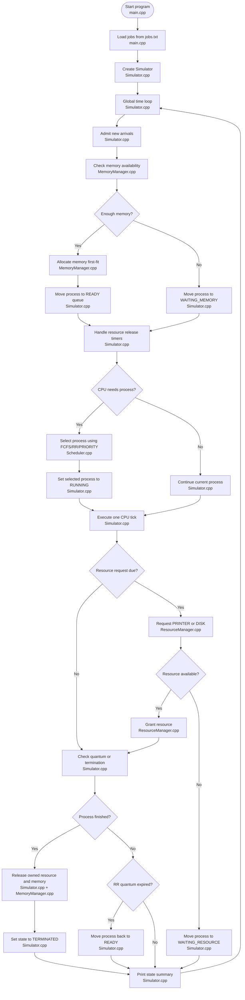

# MiniOS Printer Simulation Project (C++)

This project is a user-space MiniOS simulator for CSCI 114. The topic is a printer/resource simulation. It demonstrates process states, CPU scheduling, memory blocking, shared resource blocking, synchronization rules, and structured event logs.

## What the simulator demonstrates

- Process states: `NEW`, `READY`, `RUNNING`, `WAITING_MEMORY`, `WAITING_RESOURCE`, `TERMINATED`
- Scheduling policies:
  - `FCFS`
  - `RR` with configurable quantum
  - `PRIORITY` where the lower number has higher priority
- Fixed-size contiguous memory using first-fit allocation
- Memory blocking when a job cannot be admitted because memory is unavailable
- Two shared resources:
  - `PRINTER` with capacity 1
  - `DISK` with capacity 1
- Resource blocking when a process requests a busy shared resource
- FIFO waiting behavior for resource queues
- Logs showing scheduling decisions, state transitions, resource acquisition, resource release, memory allocation, memory release, and termination

## Default design choices

- Total memory: `1024`
- Main shared resource: `PRINTER`
- Additional shared resource: `DISK`
- Resource capacity: one process at a time for each resource
- RR quantum: `2` by default
- Third scheduler: `PRIORITY`, non-preemptive, lower number = higher priority
- Memory policy: first-fit contiguous allocation with merge-on-free
- Synchronization/control rule: a process can only acquire a shared resource if the resource has available capacity. If the resource is busy, the process moves to `WAITING_RESOURCE` and waits in a FIFO queue until the resource is released.

## Build

```bash
make
```

## Run

Recommended commands:

```bash
./os_sim --policy FCFS --jobs jobs.txt
./os_sim --policy RR --quantum 2 --memory 1024 --jobs jobs.txt
./os_sim --policy PRIORITY --jobs jobs.txt
```

The program also supports the simpler positional format:

```bash
./os_sim jobs.txt FCFS
./os_sim jobs.txt RR 2
./os_sim jobs.txt PRIORITY
```

## Jobs file format

Each non-comment line in `jobs.txt` uses this format:

```text
pid arrival burst memory priority [RESOURCE@requestTick:holdDuration ...]
```

For example:

```text
1 0 7 200 2 PRINTER@2:4
```

This means:

- Process ID is `1`
- Arrival time is `0`
- CPU burst time is `7`
- Memory requirement is `200`
- Priority is `2`
- The process requests the `PRINTER` after it has executed 2 CPU ticks
- The process holds the `PRINTER` for 4 ticks

## Default demo scenario

The included `jobs.txt` creates 5 processes. It is designed to show:

- At least 5 jobs/processes
- Memory allocation and memory blocking
- Printer acquisition, printer blocking, and printer release during Round Robin
- A second resource, `DISK`, being acquired and released
- Visible scheduler decisions under FCFS, RR, and PRIORITY
- State summaries at every CPU tick

## Architecture



## How this matches the final checklist

- Program runs from a clean compile: use `make`
- At least 5 jobs/processes are created: `jobs.txt` contains 5 jobs
- At least 2 shared resources exist: `PRINTER` and `DISK`
- Scheduling decisions are visible: logs say `Scheduler selected PID ... using policy ...`
- At least one waiting/blocking event occurs: memory blocking and printer blocking are logged
- Resources are released correctly: logs show `released PRINTER` and `released DISK`
- Output format is readable and structured: each CPU tick has a header and state summary
- Architecture diagram matches implementation: diagram names the actual files used in this project
